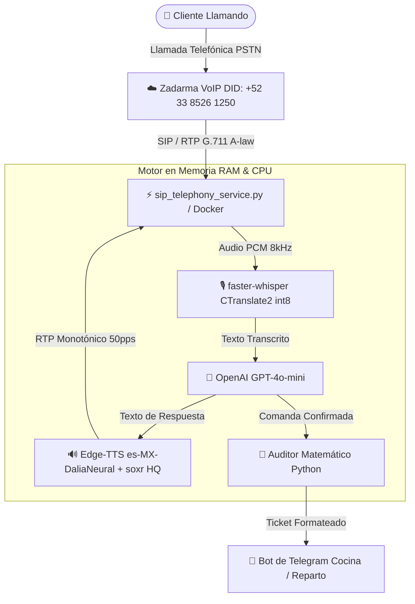

# 🍣 Restaurante Ryu - Sistema Telefónico con IA y Gestión de Pedidos

Sistema automatizado de recepcionista telefónica e inteligencia artificial conversacional para el restaurante **Ryu** y **Capri Cucina Italiana** en Tequila, Jalisco. Diseñado para atender llamadas telefónicas reales en tiempo real a través de VoIP (SIP), responder dudas sobre el menú, tomar pedidos a domicilio o para recoger en sucursal, auditar la matemática de los costos y despachar comandas estructuradas al canal de Telegram y sistemas de cocina.

---

## 🚀 Arquitectura del Sistema



* **Telefonía SIP/RTP:** Enlace troncal SIP directo con Zadarma mediante `pyVoIP`, con parches de latencia cero, temporizador multimedia de 1ms, recepción simétrica de paquetes de audio (RFC 4961) y detector de corte de flujo RTP para colgado instantáneo.
* **Speech-to-Text (STT):** `faster-whisper` (`base`, cuantización `int8`) ejecutándose 100% en RAM y CPU local. Latencia promedio: **~1.4 segundos** a costo **$0.00 USD/minuto**.
* **Inteligencia Artificial (LLM):** OpenAI `gpt-4o-mini` guiado por el catálogo estructurado `menu_ryu.json` y el prompt especializado `prompt_voice_telephone_ryu.md`.
* **Text-to-Speech (TTS):** Microsoft Edge-TTS (`es-MX-DaliaNeural`), filtrado y remuestreado con `soxr` y escalado acústico para telefonía analógica a 8 kHz G.711 A-law.
* **Auditoría Matemática:** Algoritmo determinístico en Python que previene alucinaciones aritméticas sumando platillos, extras y costos de envío antes de emitir la comanda.

---

## 📂 Estructura del Proyecto

```text
.
├── Dockerfile                           # Definición de contenedor optimizado (Python 3.11 Debian)
├── docker-compose.yml                   # Orquestación de producción con network_mode: host
├── requirements.txt                     # Dependencias de Python verificadas
├── .env.example                         # Plantilla de variables de entorno seguras
├── .gitignore                           # Exclusiones de Git (credenciales, audios, logs)
├── .dockerignore                        # Exclusiones de construcción de imagen Docker
├── .github/
│   └── workflows/
│       └── docker-ci.yml                # CI/CD automatizado en GitHub Actions
├── sip_telephony_service.py             # Servicio principal de telefonía SIP VoIP en vivo
├── voice_engine_ryu.py                  # Motor conversacional, LLM, VAD y despacho
├── menu_ryu.json                        # Catálogo y reglas de negocio estructuradas para IA
├── prompt_voice_telephone_ryu.md        # Personalidad e instrucciones de la recepcionista
├── knowledge_base_ryu.md                # Base de conocimiento del restaurante
├── order_service.py                     # Validador de menús por horario y formateador
└── README.md                            # Documentación del proyecto
```

---

## ⚙️ Configuración y Variables de Entorno

1. Copia la plantilla `.env.example` a un nuevo archivo `.env`:
   ```bash
   cp .env.example .env
   ```

2. Configura tus credenciales en el archivo `.env`:
   ```dotenv
   # OpenAI
   OPENAI_API_KEY=sk-proj-tu_clave_de_openai_aqui

   # Zadarma SIP
   ZADARMA_SIP_SERVER=sip.zadarma.com
   ZADARMA_SIP_USER=20432
   ZADARMA_SIP_PASSWORD=tu_contraseña_sip
   ZADARMA_PHONE_NUMBER=+523385261250

   # Telegram
   TELEGRAM_BOT_TOKEN=tu_telegram_bot_token
   TELEGRAM_CHAT_ID=-100xxxxxxxxxx
   ```

---

## 🐳 Despliegue con Docker y Docker Compose

### En Servidores Linux / VPS (Recomendado para Producción)
En Linux, el contenedor corre con `network_mode: host` para recibir el tráfico UDP de SIP (puerto 5060) y RTP directamente sin lidiar con mapeos complejos de puertos dinámicos.

1. **Construir y levantar el contenedor en segundo plano:**
   ```bash
   docker compose up -d --build
   ```

2. **Monitorear los logs en tiempo real:**
   ```bash
   docker compose logs -f
   ```

3. **Detener el servicio:**
   ```bash
   docker compose down
   ```

---

## 💻 Ejecución Local (Windows / Linux sin Docker)

1. **Crear y activar un entorno virtual:**
   ```bash
   python -m venv venv
   # En Windows:
   .\venv\Scripts\activate
   # En Linux / Mac:
   source venv/bin/activate
   ```

2. **Instalar dependencias:**
   ```bash
   pip install --upgrade pip
   pip install -r requirements.txt
   ```

3. **Iniciar el servicio telefónico:**
   ```bash
   python -u sip_telephony_service.py
   ```

---

## 🧠 Base de Datos de Grafos (PostgreSQL + Apache AGE) y KAG

El sistema incorpora una capa de grafos de conocimiento con **Apache AGE** (A Graph Extension for PostgreSQL) y **KAG (Knowledge-Augmented Generation)**:

1. **Grafo de Conocimiento (openCypher):**
   - Modela la ontología completa del restaurante: `(:Dish)`, `(:Category)`, `(:Zone)`, `(:Customer)`, `(:Alias)`.
   - Consulta y enlaza relaciones: `(:Dish)-[:BELONGS_TO]->(:Category)` y `(:Dish)-[:HAS_ALIAS]->(:Alias)`.
2. **KAG Anti-Alucinación (Ground Truth):**
   - Anclaje factual determinista antes de la generación: inyecta precios exactos, reglas de horarios y tarifas de envío en tiempo real.
   - Guardián post-generación: audita la respuesta del LLM antes de hablar o despachar, corrigiendo automáticamente cualquier desviación de precios o inventiva aritmética.
3. **Bucle de Autoaprendizaje Continuo (Self-Learning):**
   - Aprende dinámicamente alias fonéticos y regionalismos cuando el cliente corrige al bot ("no, quise decir X").
   - Recuerda preferencias y direcciones de clientes recurrentes para agilizar el pedido.
4. **Protocol Buffers (Protobuf v3):**
   - Esquemas estrictos en `proto/` (`ryu_order.proto`, `ryu_telephony.proto`, `ryu_kag.proto`).
   - Serialización binaria ultra compacta (~300-450 bytes) almacenada en columnas `BYTEA` de PostgreSQL y transferida entre servicios con latencia cero.

Para compilar esquemas proto:
```bash
python -m grpc_tools.protoc -Iproto --python_out=proto proto/ryu_order.proto proto/ryu_telephony.proto proto/ryu_kag.proto
```

Para correr las pruebas automatizadas del pipeline KAG y Protobuf:
```bash
python test_kag_pipeline.py
```

---


Para subir este proyecto a tu cuenta de GitHub:

1. **Crea un repositorio vacío en GitHub** (por ejemplo, con el nombre `ryu-ai-telephony`).
2. **Vincula tu repositorio local y sube los cambios:**
   ```bash
   git remote add origin https://github.com/<TU_USUARIO>/ryu-ai-telephony.git
   git branch -M main
   git push -u origin main
   ```

> [!NOTE]
> Las credenciales reales en tu archivo `.env` y las grabaciones dinámicas de audio están estrictamente ignoradas en `.gitignore`, por lo que puedes compartir tu código con total tranquilidad.

---

## 📜 Licencia y Contacto
Desarrollado para **Restaurante Ryu** — Paseo del Centenario 27, Colonia Cofradía, Tequila, Jalisco.
Teléfono SIP: **+52 33 8526 1250**.
